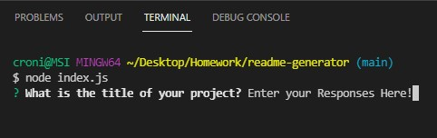
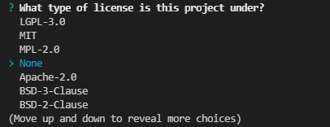

# README Generator

  ## Description
  

  This application prompts the user for key details about their project and generates well organized and professional README file so that less time is spent working a the README and more time spent working on the project.  

  [Video Demo of Application](https://drive.google.com/file/d/14ngsbt_L-6UMsPm-MlA6qxsRPRsbrupt/view)

  ## Table of Contents

  - [Installation](#installation)
  - [Usage](#usage)
  - [License](#license)
  - [Contributing](#contributing)
  - [Tests](#tests)
  - [Questions](#questions)

  ## Installation

  * Pull this repository
  * In the terminal type `npm i` 

  ## Usage

  1. Enter `node index.js` into your terminal

  2. Answer the prompts in the terminal and choose a license, select 'None' if the project is not covered by a license.

  

  

  3. When all prompts are answered a `README.md` will be created in the `/output` folder
  
  4. Copy the `README.md` from the `/output` folder into your project folder
  
  
  ## License
  [This project is covered by the MIT license](https://opensource.org/licenses/MIT)
  

  ## Contributing

  Fork a copy of the repository, make your enhancements and make a pull request. My contact information is below in the [Questions](#questions) section.

  ## Tests

  There are currently no tests for this.

  ## Questions

  For any additional questions please reach out to me at:

  [My Github Profile](https://github.com/AdrianCronin)

  [Email](mailto:acronindev@gmail.com)

